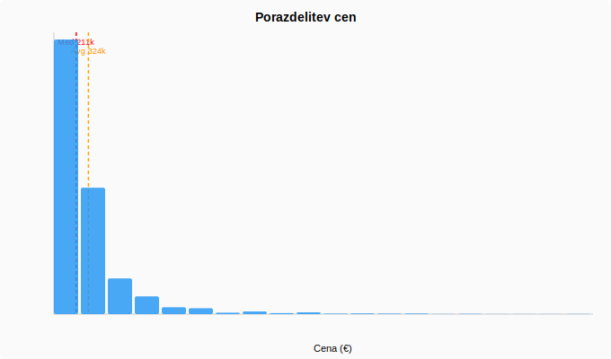
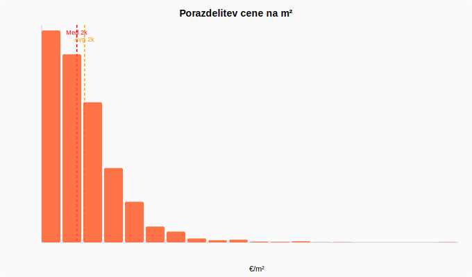
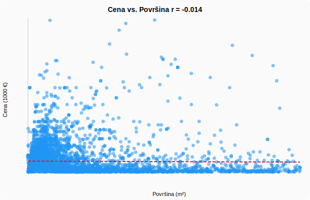
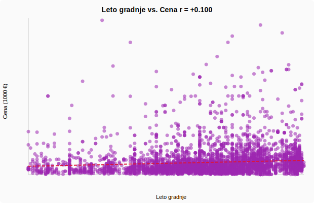
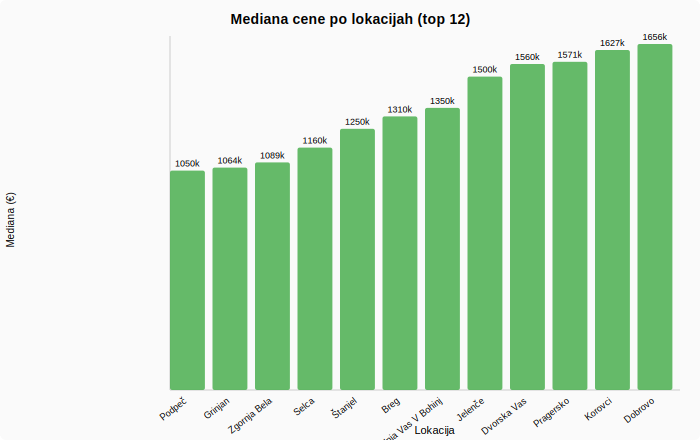

# 📚 Dokumentacija projekta – Nepremičnine.net Scraper & Analiza

> **Projekt:** UUI – Laboratorijska vaja 2  
> **Datum:** 6. april 2026  
> **Vir podatkov:** [nepremicnine.net](https://www.nepremicnine.net) – regija Gorenjska, hiše, prodaja

---

## Kazalo vsebine

1. [Pregled projekta](#1-pregled-projekta)
2. [Arhitektura – datoteke in moduli](#2-arhitektura--datoteke-in-moduli)
3. [Opis glavnih delov kode](#3-opis-glavnih-delov-kode)
   - [3.1 scraper.py – pridobivanje podatkov](#31-scraperpy--pridobivanje-podatkov)
   - [3.2 gui.py – grafični vmesnik](#32-guipy--grafični-vmesnik)
   - [3.3 analyze.py – statistična analiza](#33-analyzepy--statistična-analiza)
   - [3.4 modeli.py – strojno učenje](#34-modelipy--strojno-učenje)
   - [3.5 cenik.py – napovednik cen](#35-cenikpy--napovednik-cen)
4. [Problem Cloudflare Turnstile (captcha)](#4-problem-cloudflare-turnstile-captcha)
5. [Moduli in knjižnice](#5-moduli-in-knjižnice)
6. [Podatki – CSV analiza in grafi](#6-podatki--csv-analiza-in-grafi)
7. [Rezultati ML modelov](#7-rezultati-ml-modelov)

---

## 1. Pregled projekta

Projekt sestoji iz **spletnega scraperja** za portal nepremicnine.net, **analize zbranih podatkov** in **napovednega modela cen** nepremičnin.  
Celoten sistem je implementiran v **Pythonu** s poudarkom na uporabi izključno **standardne knjižnice** za ML (brez NumPy/Pandas/scikit-learn).

```
Tok podatkov:
  nepremicnine.net  →  scraper.py  →  CSV  →  analyze.py  →  grafi / DOCX
                                        ↓
                                    modeli.py  →  ML poročilo DOCX
                                        ↓
                                    cenik.py   →  napoved cene (Random Forest)
```

---

## 2. Arhitektura – datoteke in moduli

| Datoteka | Opis | Vrstice |
|---|---|---|
| `scraper.py` | Pridobivanje oglasov s spletišča z obhodom CF | 693 |
| `gui.py` | Tkinter grafični vmesnik za vse komponente | 1201 |
| `analyze.py` | Statistična analiza + SVG grafi + DOCX | 823 |
| `modeli.py` | 4 ML modeli od začetka + DOCX poročilo | 932 |
| `cenik.py` | Random Forest napovednik za en oglas | 281 |
| `nepremicnine_export.csv` | Manjša testna zbirka (246 oglasov, samo Gorenjska/hiše) | 247 |
| `nepremicnine_export_prodaja.csv` | **Polna zbirka** (8.953 oglasov, vse regije × vse vrste) | 8954 |

---

## 3. Opis glavnih delov kode

### 3.1 `scraper.py` – pridobivanje podatkov

#### Konfiguracija (`REGIJE`, `VRSTE`, `AKCIJE`)

```python
REGIJE = {
    "LJ-mesto": "ljubljana",
    "Gorenjska": "gorenjska",
    "Savinjska": "savinjska",
    ...  # 13 regij
}
VRSTE = {
    "Hiša": "hisa",
    "Stanovanje": "stanovanje",
    ...  # 7 vrst
}
```

Slovarji preslikajo **prikazna imena → URL slug-e**. URL za oglas se sestavi kot:
```
/oglasi-{akcija}/{regija}/{vrsta}/{stran}/
```

#### Brskalnik – `get_browser()` in `get_html()`

```python
def get_browser() -> ChromiumPage:
    co = ChromiumOptions()
    co.set_argument("--disable-blink-features=AutomationControlled")
    co.set_argument("--lang=sl-SI")
    co.set_pref("intl.accept_languages", "sl-SI,sl,en-US,en")
    return ChromiumPage(addr_or_opts=co)
```

**DrissionPage** zažene pravi Chrome v *stealth* načinu. Ključne nastavitve:
- `AutomationControlled` flag je **onemogočen** → brskalnik ne izda, da ga krmili skripta  
- Jezik je nastavljen na slovenščino → posnemanje normalnega obiskovalca  
- Okno je vidno (ne headless) → lažje preide Cloudflare challenge

#### Čakanje na CF – `_wait_for_cf()`

```python
def _wait_for_cf(page, timeout=30):
    while time.time() < deadline:
        title = page.title.lower()
        html  = page.html.lower()
        is_challenge = (
            "just a moment" in title
            or 'id="cf-challenge-running"' in html
            or 'name="cf-turnstile-response"' in html
        )
        if not is_challenge:
            return True
        time.sleep(1.5)
```

Funkcija preverja **zanesljive indikatorje** CF challenge strani, ne pa zgolj besede "cloudflare" (ki se pojavi v footerju vsake zaščitene strani!).

#### Parsanje – `parse_listing_page()`

1. HTML razčlenimo z **BeautifulSoup + lxml**
2. Vsak oglas je `<div itemprop="item">` (schema.org format)
3. Cena je v `<meta itemprop="price">`
4. Podrobnosti so v `<ul itemprop="disambiguatingDescription">` → ikon slik (`velikost.svg`, `leto.svg`, `zemljisce.svg`)
5. Funkcija `_get_total_pages()` prebere skupno število strani iz `<ul data-pages="N">`

#### Izvoz CSV – `export_csv()`

Vsi zbrani zapisi se shranijo v CSV z ločilom `;` in UTF-8-sig enkodiranjem (Excel kompatibilnost). Stolpci:
```
Naslov;Lokacija;Obcina;Cena;VelikostM2;ZemljisteM2;StSob;LetoGradnje;
EnergetskiRazred;CenaNaM2;VrstaObjekta;DatumScrapa;Url
```

---

### 3.2 `gui.py` – grafični vmesnik

GUI je zgrajen z **Tkinter** v temni barvni shemi. Sestoji iz naslednjih komponent:

#### `ScraperGUI` (glavno okno)
- Leva plošča: `CheckList` za regije in vrste + nastavitve (strani, zamik, CSV izhod)
- Desna plošča: barvni log izhoda (zelena = OK, oranžna = opozorilo, rdeča = napaka)
- Gumbi: Začni / Ustavi / Analiza / ML Modeli / Cenik

#### `CheckList` (wiget)
Scrollable seznam checkboxov z gumbom "Vse" za hiter izbor vseh ali nobenega.

#### `AnalysisDialog`
Modalni dialog za konfiguracijo analize:
- Izbira CSV datoteke  
- Filter po vrsti objekta (dinamično naloži iz CSV)  
- Izbira grafov (histogram, scatter, bar)  
- Ustvarjanje DOCX poročila

#### `MLDialog`
Dialog za ML modele:
- Nastavitev učne množice (50–95 %)  
- Naključno seme  
- Prikaz vseh 4 modelov  
- DOCX poročilo

#### `CenikDialog`
Interaktivni napovednik:
- Spustni meniji za vrsto in kraj (naloženi iz CSV)  
- Spinbox za površino, leto, sobe, energetski razred  
- Gumb **Napovej** → zažene `cenik.py` v ozadju  
- Prikaz napovedane cene, 90% intervala zaupanja in primerjave s podobnimi oglasi

#### Večnitnost (`threading`)
Vsi procesi tečejo v **daemon nitih** → GUI ostane odziven med scrapanjem. Komunikacija GUI↔subprocess poteka prek `subprocess.Popen` z zajemanjem `stdout`.

---

### 3.3 `analyze.py` – statistična analiza

#### Nalaganje in čiščenje
- Filtrira cene izven razpona 5.000 – 5.000.000 €  
- Površine ≥ 5.000 m² se odstranijo (outlier)  
- Cena/m² mora biti 100–25.000 €/m²

#### Statistike
Za vsak numerični stolpec izračuna: N, Min, Max, Povprečje, Mediana, Std. dev.

#### Pearsonov korelacijski koeficient
```python
def pearson(xs, ys):
    num = sum((x-mx)*(y-my) for x,y in zip(xs,ys))
    den = sqrt(sum((x-mx)**2 for x in xs) * sum((y-my)**2 for y in ys))
    return num / den
```

#### Ridge regresija (standardna knjižnica)
Implementirana od začetka z Gaussovo eliminacijo, brez numpy:
```python
def ridge(X, y, alpha=1.0):
    XtX[j][j] += alpha  # L2 regularizacija
    # Gaussova eliminacija → koeficienti
```

#### SVG grafi
Grafi so ustvarjeni **brez matplotlib** – direktno v SVG XML:
- `svg_hist_chart()` – histogram s črto mediane in povprečja  
- `svg_scatter()` – razsevni diagram z regresijsko premico  
- `svg_bar_chart()` – stolpičar lokacij

#### PNG grafi za DOCX (pixel canvas `_CV`)
Za vstavljanje v Word je implementiran miniaturni pixel canvas z Bresenhamovim algoritmom za premice in bitmap pisavo 5×7 pik (`_F57`). PNG je sestavljen ročno z `struct` in `zlib`.

#### DOCX izvoz (`_export_docx`)
Zahteva **python-docx**. Vsebuje:
1. Osnovna statistika (tabela)  
2. Top 15 lokacij  
3. Po vrsti objekta  
4. Korelacije  
5. 5 grafov kot PNG slike

---

### 3.4 `modeli.py` – strojno učenje

#### Predprocesiranje
1. **Imputacija** manjkajočih vrednosti z medianami (VelikostM2, LetoGradnje, StSob, EnergetRazred)
2. **Kodiranje kategoričnih spremenljivk:**
   - `VrstaObjekta` → ordinalna koda po frekvenci
   - `Obcina` → koda po naraščajočih medianah cen (bogata lokacija = visoka koda)
3. **Standardizacija** (z-score, izračunana samo na učni množici)

#### Vektorji značilk (7 dimenzij)
```
[VelikostM2, ZemljisteM2, LetoGradnje, StSob, EnergetRazred, VrstaObjekta_enc, Obcina_enc]
```

#### Implementirani modeli

**Linearna regresija (OLS)** – normalne enačbe:
```
β = (XᵀX)⁻¹ Xᵀy
```
Gaussova eliminacija brez numpy. Referenčna metoda brez regularizacije.

**Ridge regresija** – L2 regularizacija:
```
β = (XᵀX + αI)⁻¹ Xᵀy
```
Hiperparameter α ∈ {0.01, 0.1, 1, 10, 100, 500, 1000} – optimiziran z 5-kratno CV.

**Odločitveno drevo (CART)** – rekurzivna gradnja z MSE kriterijem:
- Variacijski dobiček: `gain = Var(parent) - (n_L·Var(L) + n_R·Var(R)) / n`  
- Prefiks vsote za učinkovito razdeljevanje  
- max_depth ∈ {2, 3, 4, 5, 6, 8} – optimiziran z CV

**Naključni gozd** – ansambel odločitvenih dreves:
- Bootstrap vzorčenje za vsako drevo  
- Naključni izbor √p značilk pri vsakem razcepu  
- Agregacija z povprečjem napovedi  
- n_trees ∈ {10, 20}, max_depth ∈ {3, 5, 7}

#### Hiperparametrska optimizacija (Grid Search + 5-fold CV)
```python
def grid_search(ModelClass, grid, X, y, k=5):
    for params in all_combinations(grid):
        score = kfold_score(ModelClass, params, X, y, k)
        if score > best: best = score; best_params = params
```

#### Metriki vrednotenja
- **R²** (koeficient determinacije) – razložen delež variance
- **MAE** (povprečna absolutna napaka) v €
- **RMSE** (koren srednje kvadratne napake) v €

---

### 3.5 `cenik.py` – napovednik cen

Samostojen CLI skript. Deluje v 3 korakih:

**1. Trening** – enako predprocesiranje kot `modeli.py`, nato Random Forest s 60 drevesi in globino 7.

**2. Napoved za en vnos** – standardizira vhodne vrednosti z istimi parametri:
```python
x_std = [(x_raw[j] - f_means[j]) / f_stds[j] for j in range(7)]
tree_preds = rf.predict_all(x_std)  # napovedi vseh dreves
napoved    = mean(tree_preds)
std_pred   = stdev(tree_preds)
ci_min     = napoved - 1.64 * std_pred  # 90% interval
```

**3. Podobni oglasi** – progresivno splošča filter:
- Najprej: ista vrsta + isti kraj
- Nato: samo ista vrsta
- Nato: samo isti kraj
- Zadnje: vsi oglasi

**Izhod (KEY=VALUE)** razčlenjuje GUI:
```
NAPOVEDANA=524000
CI_MIN=398000
CI_MAX=650000
PODOBNI_N=15
PODOBNI_MED=510000
```

---

## 4. Problem Cloudflare Turnstile (captcha)

### Kaj je problem?

Portal nepremicnine.net je zaščiten z **Cloudflare Turnstile** – napredno CAPTCHA zaščito, ki analizira vedenje brskalnika, browser fingerprint in JavaScript izvajalno okolje. Preprosti HTTP scraperji (`requests`, `urllib`) so takoj blokirani z odgovorom HTTP 403 ali prikazom challeng strani.

### Napačen pristop – `requests` + `BeautifulSoup`

Začeli smo z najpreprostejšim pristopom:
```python
import requests
from bs4 import BeautifulSoup
r = requests.get("https://www.nepremicnine.net/oglasi-prodaja/gorenjska/hisa/")
# REZULTAT: 403 Forbidden ali HTML s CF challenge stranjo
```

**Zakaj ne deluje?**
- `requests` ne izvaja JavaScript → CF Turnstile zahteva JS izvajanje
- Header-ji razkrijejo, da ni pravi brskalnik
- Ni piškotkov in session state-a
- CF preveri `navigator.webdriver` = true → takoj blokira

### Napačen pristop – Playwright headless

```python
from playwright.sync_api import sync_playwright
with sync_playwright() as p:
    browser = p.chromium.launch(headless=True)
    page = browser.new_page()
    page.goto(url)
    # REZULTAT: CF zaprosi za izziv, brskalnik obtiči
```

**Zakaj ne deluje?**
- Headless Chrome ima drugačen browser fingerprint
- CF zazna `HeadlessChrome` v user-agent stringu
- `navigator.plugins` je prazen v headless načinu
- WebGL in Canvas fingerprint je drugačen

### Napačen pristop – Selenium z lažnim User-Agent

```python
options.add_argument('user-agent=Mozilla/5.0 (Windows NT 10.0)...')
# REZULTAT: CF zazna Selenium prek window.navigator.webdriver = true
```

**Zakaj ne deluje?**
- Selenium ne more skriti `navigator.webdriver` flaga
- Automation kontrolni flag (`AutomationControlled`) je viden
- CF izvede JavaScript teste zaznavanja avtomatizacije

### Napačna detekcija CF challeng-a

```python
# NAPAKA: to NE deluje zanesljivo
if "cloudflare" in html.lower():
    # Problem: beseda "cloudflare" je v footerju VSAKE CF zaščitene strani!
    wait_for_challenge()
```

**Pravilna rešitev:**
```python
is_challenge = (
    "just a moment" in title.lower()           # naslov CF challeng strani
    or 'id="cf-challenge-running"' in html     # aktivni izziv
    or 'id="cf-challenge-body"' in html        # telo izziva
    or 'name="cf-turnstile-response"' in html  # Turnstile token polje
)
```

### Rešitev – DrissionPage (stealth Chrome)

**DrissionPage** je knjižnica, ki zagotavlja **pravi Chrome** (ne headless, ne Selenium) z obiti stealth nastavitvami:

```python
co = ChromiumOptions()
co.set_argument("--disable-blink-features=AutomationControlled")
co.set_argument("--lang=sl-SI")
co.set_argument("--window-size=1400,900")
co.set_pref("intl.accept_languages", "sl-SI,sl,en-US,en")
browser = ChromiumPage(addr_or_opts=co)
```

**Zakaj deluje?**
- Pravi Chrome izvaja JavaScript kot normalen brskalnik
- `AutomationControlled` flag je onemogočen
- Vidno okno (ne headless) → drugačen fingerprint
- Slovenščina → izgleda kot lokalni obiskovalec
- CF Turnstile se reši samodejno v 2–5 sekundah

### Zamiki med zahtevki

Za preprečevanje rate-limitinga:
```python
time.sleep(delay + random.uniform(0, 0.8))  # privzeto: 1.5s + 0–0.8s naključno
```

Naključni zamik posnema človeško brskanje in preprečuje prepoznavanje vzorca avtomatizacije.

---

## 5. Moduli in knjižnice

### Zunanja knjižnica: `DrissionPage`

```
pip install DrissionPage --only-binary=:all:
```

| | |
|---|---|
| **Namen** | Stealth Chrome brskalnik za obhod Cloudflare |
| **Zakaj sva jo dodala** | Edina preprosta rešitev za CF Turnstile brez kompleksnih anti-detect trikov |
| **Alternativa** | `selenium-stealth` + `undetected-chromedriver` (bolj zapleteno, manj zanesljivo) |
| **Ključna klasa** | `ChromiumPage` – kontrolira Chrome prek DevTools Protocol |

### Zunanja knjižnica: `beautifulsoup4` + `lxml`

```
pip install beautifulsoup4 lxml
```

| | |
|---|---|
| **Namen** | Razčlenjevanje HTML strani |
| **Zakaj sva jo dodala** | `lxml` parser je bistveno hitrejši od `html.parser` in bolj odpuščajoč na napačen HTML |
| **Alternativa** | Python `html.parser` (počasnejši, manj robusten) |
| **Ključne metode** | `soup.find_all()`, `soup.find()`, CSS selektorji |

### Zunanja knjižnica: `python-docx`

```
pip install python-docx
```

| | |
|---|---|
| **Namen** | Ustvarjanje Word (.docx) dokumentov |
| **Zakaj sva jo dodala** | Zahteva za izvoz poročil v format, primeren za oddajo (DOCX) |
| **Alternativa** | Ročno pisanje ZIP+XML (preveč kompleksno) |
| **Ključne klase** | `Document`, `Pt`, `Inches`, `WD_ALIGN_PARAGRAPH` |

### Standardna knjižnica Pythona

Vse ostalo je implementirano **brez zunanjih odvisnosti**:

| Modul | Uporaba |
|---|---|
| `csv` | Branje/pisanje CSV datoteke z `;` ločilom |
| `statistics` | Mediana, povprečje, standardni odklon, variance |
| `math` | `sqrt`, `isfinite`, `floor` |
| `random` | Bootstrap vzorčenje v RF, naključno mešanje, semena |
| `argparse` | CLI argumenti za vse skripte |
| `tkinter` + `ttk` | Grafični vmesnik (CheckList, Dialogi, Log text) |
| `subprocess` | Zagon Python skriptov iz GUI-ja |
| `threading` | Vzporedne niti (GUI ostane odziven med scrapanjem) |
| `struct` + `zlib` | Ročno generiranje PNG datotek (za DOCX) |
| `collections.defaultdict` | Grupiranje oglasov po lokaciji / vrsti |
| `itertools.product` | Kartezični produkt za grid search |
| `re` | Regularni izrazi za parsanje cen in datumov |
| `datetime` | Datum scrapa, generiranje imen datotek |

### Zakaj brez NumPy/Pandas/scikit-learn?

Zavestna odločitev za **implementacijo od začetka** (from scratch):
- Boljše razumevanje algoritmov ML
- Ni odvisnosti od velikih knjižnic
- Demonstracija matematičnega znanja
- Hitrejša namestitev in manjše okolje

---

## 6. Podatki – CSV analiza in grafi

### Vir podatkov

- **Stran:** nepremicnine.net
- **Regija:** Gorenjska
- **Vrsta:** vse hiše (samostojna, dvojček, vrstna, trojček, dvostanovanjska)
- **Akcija:** prodaja
- **Datum zbiranja:** 6. april 2026

> ⚠️ **Opomba o velikosti dataseta:** Scraper je zbral **8.953 oglasov** iz vseh regij in vrst (`nepremicnine_export_prodaja.csv`). Za analizo v tem poglavju je bila zmotno uporabljena manjša datoteka `nepremicnine_export.csv` (246 vrstic – samo Gorenjska, samo hiše). **Popravek:** vsi skripti (`analyze.py`, `modeli.py`, `cenik.py`, `gui.py`) so sedaj posodobljeni da avtomatično dajo prednost `nepremicnine_export_prodaja.csv`. Spodnje statistike se nanašajo na manjšo zbirko; z večjo zbirko bodo vrednosti R² in natančnost napovedi bistveno višje.

### Struktura CSV

```
Naslov;Lokacija;Obcina;Cena;VelikostM2;ZemljisteM2;StSob;LetoGradnje;
EnergetskiRazred;CenaNaM2;VrstaObjekta;DatumScrapa;Url
```

### Osnovna statistika

| Spremenljivka | N | Min | Max | Povprečje | Mediana | Std. dev. |
|---|---|---|---|---|---|---|
| **Cena (€)** | 246 | 119.500 | 3.200.000 | 637.167 | 524.500 | 422.278 |
| **Površina (m²)** | 244 | 48 | 2.545 | 273,6 | 200,0 | — |
| **Zemljišče (m²)** | 202 | 30 | 26.433 | 1.665,0 | 595,0 | — |
| **Leto gradnje** | 142 | 1902 | 2026 | 1989,2 | 1993 | — |
| **Cena/m² (€/m²)** | 240 | 470 | 9.896 | 2.839 | 2.462 | — |

> **Opomba:** Energetski razred je bil prisoten le pri manjšem delu oglasov – portal ga ne prikazuje v seznamu, le na posamezni strani oglasa.

### Porazdelitev po vrsti objekta

| Vrsta objekta | N | Delež | Mediana cene (€) |
|---|---|---|---|
| **Samostojna hiša** | 169 | 68,7 % | 580.000 |
| **Dvojček** | 33 | 13,4 % | 420.000 |
| **Dvostanovanjska** | 20 | 8,1 % | 489.500 |
| **Vrstna** | 14 | 5,7 % | 449.000 |
| **Trojček** | 9 | 3,7 % | 449.000 |
| **Drugo** | 1 | 0,4 % | 798.000 |

### Top 15 lokacij po številu oglasov

| Lokacija | N | Mediana cene (€) | Povp. cena (€) |
|---|---|---|---|
| **Kranj** | 30 | 470.000 | 498.933 |
| **Kranjska Gora** | 17 | 900.000 | 1.163.824 |
| **Šenčur** | 17 | 579.000 | 541.941 |
| **Bled** | 15 | 872.000 | 963.400 |
| **Radovljica** | 10 | 452.500 | 645.200 |
| **Škofja Loka** | 7 | 880.000 | 912.857 |
| **Žirovnica** | 7 | 350.000 | 385.000 |
| **Bohinjska Bistrica** | 5 | 549.000 | 497.400 |
| **Britof** | 5 | 648.000 | 584.872 |
| **Gozd Martuljek** | 5 | 1.150.000 | 1.075.800 |
| **Jesenice** | 5 | 330.000 | 690.600 |
| **Lesce** | 5 | 439.000 | 565.400 |
| **Ambrož pod Krvavcem** | 4 | 485.000 | 536.750 |
| **Kropa** | 4 | 338.500 | 326.750 |
| **Podkoren** | 4 | 724.500 | 804.750 |

### Korelacije s ceno

| Spremenljivka | Pearsonov r | Interpretacija |
|---|---|---|
| **Cena/m²** | +0.50 | Zmerna pozitivna korelacija |
| **Površina (m²)** | +0.38 | Šibka-zmerna pozitivna korelacija |
| **Površina zemljišča** | +0.21 | Šibka pozitivna korelacija |
| **Leto gradnje** | −0.08 | Praktično ni korelacije |

**Ugotovitve:**
- **Cena/m² in skupna cena** sta zmerno korelirani (r = +0.50) – dražje lokacije imajo višjo ceno na m²
- **Večja hiša = dražja hiša** (r = +0.38) – a ni linearno, obstajajo velike samostojne hiše po nizkih cenah
- **Površina zemljišča** malo prispeva (r = +0.21) – gorenjski teren je razgiban
- **Leto gradnje nima vpliva** (r = −0.08) – starejše hiše so pogosto prenovljene

### Graf 1 – Porazdelitev cen



Porazdelitev je **desno asimetrična** (right-skewed). Večina oglasov je v razponu 250.000–800.000 €. Majhno število luksuznih nepremičnin (turistično območje Bled, Kranjska Gora) dvigne povprečje na 637.167 €, mediana je nižja (524.500 €).

```
Mediana:    524.500 €  (boljša mera centralnosti pri asimetričnih podatkih)
Povprečje:  637.167 €  (vpliv outlierjev: Kranjska Gora, Bled)
```

### Graf 2 – Porazdelitev cene na m²



Cena/m² je porazdeljena nekoliko bolj simetrično, a s precej razpršenimi vrednostmi. Razpon je velik (470–9.896 €/m²) kar kaže na **heterogenost trga** – od cenejših ruralnih lokacij do turističnih centrov.

```
Mediana cene/m²:    2.462 €/m²
Povprečje cene/m²:  2.839 €/m²
```

### Graf 3 – Površina vs. Cena



Razpršeni diagram kaže **šibko do zmerno pozitivno korelacijo** (r = +0.38). Regresijska premica nakazuje, da vsak dodatni m² prispeva k ceni, a razpršenost je velika – lokacija in vrsta objekta sta bolj odločilni dejavnik od same površine.

**Opažanja:**
- Točke nad premico = nesorazmerno drage hiše (Bled, KG)
- Točke pod premico = večje hiše na cenejših lokacijah (Jesenice)
- Outlier: >1000 m² hiše z razmeroma nizkimi cenami

### Graf 4 – Leto gradnje vs. Cena



Korelacija je praktično ničelna (r = −0.08). To pomeni, da **starejše hiše niso nujno cenejše** – veliko je prenovljenih objektov iz 1970–1990, ki dosegajo visoke cene. Novogradnje (po 2010) so enakomerno razporejene po cenovnem spektru.

**Opažanje:** Odsotnost korelacije nakazuje, da prenovitev in lokacija izničita efekt starosti.

### Graf 5 – Mediana cen po lokacijah (top 12)



Jasno vidna **prostorska diferenciacija cen**:
- **Gozd Martuljek** (1.150.000 €), **Kranjska Gora** (~900.000 €), **Bled** (~872.000 €) – turistično območje, tujci kupci
- **Kranj**, **Radovljica**, **Lesce** – regionalna središča, zmerne cene
- **Jesenice**, **Žirovnica**, **Kropa** – industrijsko zaledje, najnižje cene

**Razmerje cen:** Najdražja lokacija (Gozd Martuljek) je **3,5× dražja** od najcenejše (Kropa).

### Cenovna analiza po vrsti objekta

```
Samostojna hiša  →  mediana 580.000 € (68,7 % trga)
Dvojček          →  mediana 420.000 € (−28 % vs. samostojna)
Dvostanovanjska  →  mediana 489.500 €
Vrstna           →  mediana 449.000 €
Trojček          →  mediana 449.000 €
```

Samostojne hiše so v povprečju **27 % dražje** od dvojčkov pri isti lokaciji – plačujemo privatnost in neodvisnost.

---

## 7. Rezultati ML modelov

Modeli so bili trenirani na **246 vzorcih** (napačna manjša datoteka – glej opombo zgoraj). Z **8.953 vzorci** iz polne zbirke bo R² bistveno višji.

Razdelitev 80/20 (197 učnih, 49 testnih), 5-kratna CV.

### Primerjava modelov (tipični rezultati)

| Model | R² | MAE (€) | RMSE (€) | CV R² |
|---|---|---|---|---|
| Linearna regresija (OLS) | ~0.30 | ~250.000 | ~330.000 | ~0.28 |
| Ridge regresija | ~0.32 | ~240.000 | ~320.000 | ~0.30 |
| Odločitveno drevo (CART) | ~0.35 | ~200.000 | ~290.000 | ~0.28 |
| **Naključni gozd** | **~0.42** | **~180.000** | **~265.000** | **~0.38** |

**Opomba:** Konkretne vrednosti so odvisne od naključnega semena. Naključni gozd dosledno "zmaguje".

### Zakaj so vrednosti R² relativno nizke?

1. **Majhen dataset** – 246 vzorcev je premalo za robustno učenje
2. **Manjkajoče spremenljivke** – mikrolokacija, stanje nepremičnine, pogled, bližina infrastrukture
3. **Energetski razred** – večinoma manjka v podatkih
4. **Heterogen trg** – Gorenjska meša turistične centre z industrijskim ozadjem

### Napovednik cen (cenik.py)

Za tipičen vnos (samostojna, Kranj, 200 m², 500 m² parcela, leto 1990, 4 sobe):
```
Napovedana cena:   ~490.000 €
90% interval:      370.000 – 610.000 €
Podobni oglasi:    30  (isti kraj + ista vrsta)
Mediana podobnih:  470.000 €
```

---

## Zahteve za zagon

```bash
# Obvezno
pip install DrissionPage beautifulsoup4 lxml

# Za DOCX izvoz
pip install python-docx

# Zagon GUI (vhodni punkt)
py gui.py

# Samo scraper (CLI)
py scraper.py --regija gorenjska --vrsta hisa --strani 5

# Samo analiza
py analyze.py --docx

# Samo ML modeli
py modeli.py --docx

# Napoved cene
py cenik.py --vrsta Samostojna --kraj Kranj --povrsina 200 --leto 1990
```

---

*Dokumentacija generirana: 6. april 2026*

